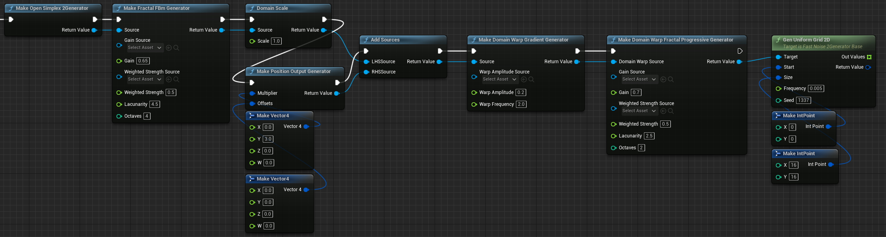

# UnrealFastNoise2
UnrealFastNoise2 is an Unreal Engine plugin that wraps [FastNoise2](https://github.com/Auburn/FastNoise2), allowing you to use the FastNoise2 library in blueprints.

Supported Unreal Engine versions: **5.4, 5.5, 5.6, 5.7, 5.8**. Prebuilt packages for each version are attached to every [release](../../releases) — download the zip matching your engine version and extract it into your project's `Plugins` folder.

Install Tips:

Use #include <FastNoise/FastNoise.h> in whatever file you need to call the FastNoise2 functions in.
To use C++ and Blueprints add "FastNoise2" to your PublicDependencyModuleNames in Project.Build.cs after installing the plugin. This will give you access to the C++ classes.
The file is located in ../ProjectName/Source/ProjectName/ProjectName.Build.cs (default location)  

